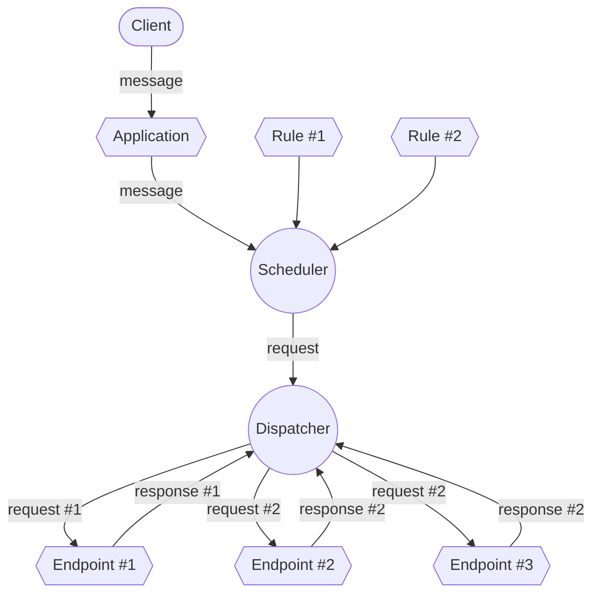
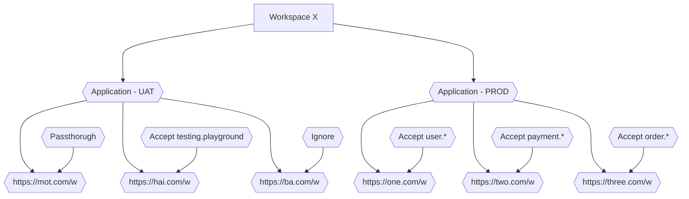

# Overview

Let's explore more concept about Kanthor to understand it better

## Overall

The fundamental concept of the Kanthor system could be descirbe as the following flowchart

Whenever a client (such as Kanthor SDK, cURL command, Postman client, etc.) makes a request to send a `message` to an **Application**, a **Scheduler** evaluates the `message` to determine which **Endpoint** the system should deliver that `message` to based on a list of configured rules. Suppose you have three **Endpoint**s that pass configured rules and need to receive that `message`. In that case, the Scheduler will generate three `request`s, combining the information from the `message` and the respective **Endpoint**, and pass them to the Dispatcher. As the final step, the **Dispatcher** sends the request and receives back the `response` from the corresponding **Endpoint**.

## Entities

There are _seven_ main entities that we need to introduce to you

- **Application**: The primary entry point for the Kanthor system, where `message`s are received and actions are initiated.
- **Endpoint**: Configured destinations (typically URLs, but extendable to other [Uniform Resource Identifier](https://en.wikipedia.org/wiki/Uniform_Resource_Identifier) formats future) for generated `request`s. Each endpoint requires at least one **Endpoint Rule** to begin processing requests; otherwise, no message will be delivered to it.
- **Endpoint Rule**: A set of rules determining whether a `message` will be scheduled for sending to an **Endpoint** or ignored.
- **Message**: An entity sent by a client, containing relevant information such as `body` and `headers`.
- **Request**: Generated by the based on a `message` and an **Endpoint**
- **Response**: The outcome returned by an **Endpoint**, indicating the success or failure of processing a `message` and `request`.

All of these concepts will be encapsulated within an entity called **Workspace**. One common use case for **Workspace** is having separate environments, such as UAT and PROD, to prevent interfering with your PROD environment with dummy data.

